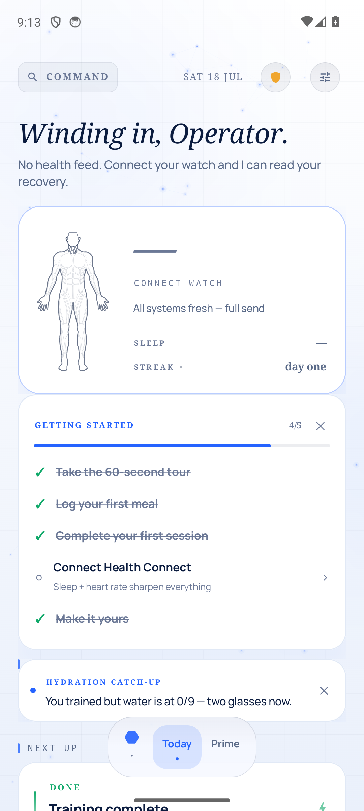
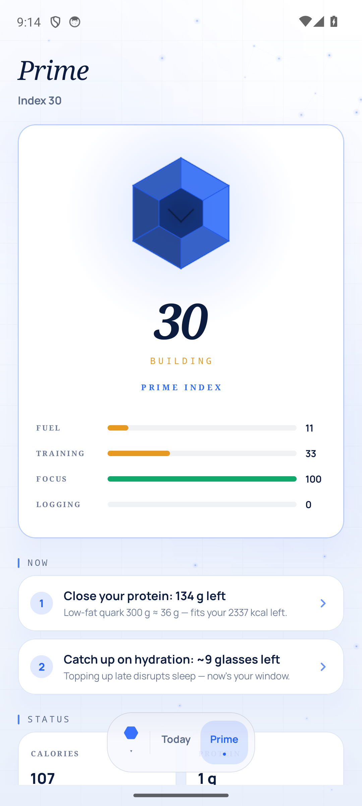
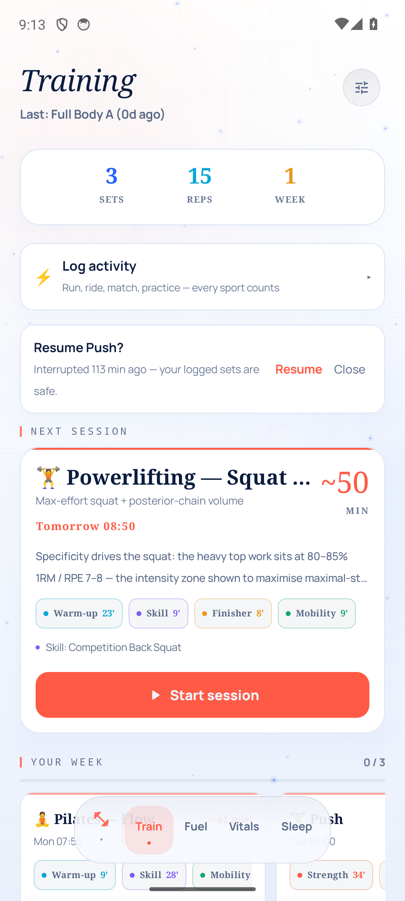
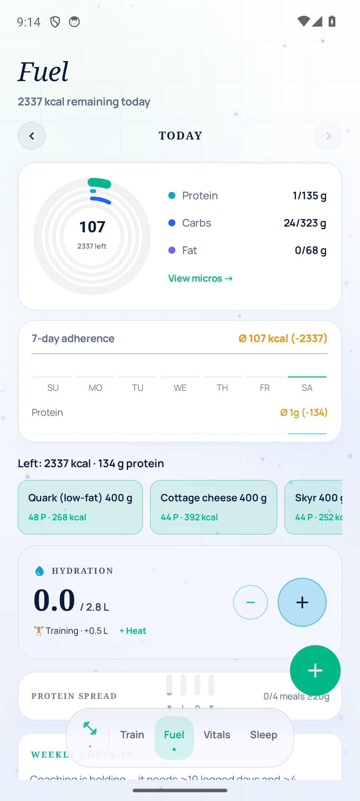
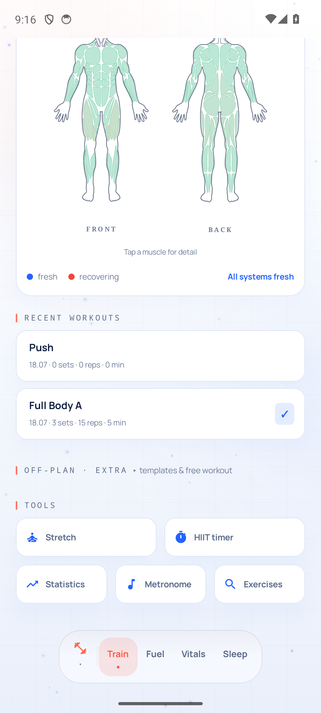
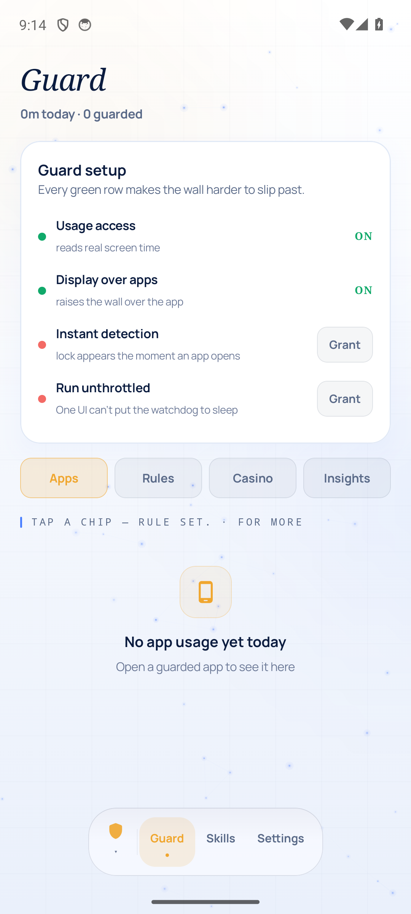

<div align="center">

# JARVIS — Life OS

**A native, offline-first Android app that fuses training, nutrition, recovery, focus, finance and study into one intelligent daily operating system.**

Built entirely with Kotlin & Jetpack Compose · one token-driven design system with **7 switchable "worlds"** · science-backed engines · no account, no cloud, no subscriptions — your data stays on the device.


</div>

---

## ✨ Overview

**JARVIS** is a personal *Life OS* — one app that replaces a stack of separate trackers (a training app, a nutrition scanner, a sleep dashboard, a focus blocker, a habit tracker, a money manager, a study tool…) with a single coherent, studies-backed system.

- **Offline-first & private.** Everything runs on-device (SharedPreferences + JSON, and Room for the relational stores). There is **no login and nothing is uploaded**. The internet is touched only for opt-in extras: Open Food Facts (barcodes), Open-Meteo (a hydration heat bonus), ICS/Untis calendar feeds, and optional GoCardless Open Banking. Health metrics are read **locally** from Android Health Connect.
- **Pure, testable engines.** Every score, target and plan is a pure calculation core that takes plain inputs and returns plain values — decoupled from storage and covered by ~50 JVM unit-test files.
- **One design system, many moods.** A single token-driven UI ("ATELIER") ships **7 worlds** you can switch instantly — `Lumen` (a bright light theme, the default), `Azure`, `Sovereign`, `Glacier`, `Neon`, `Terra`, `Mono`. Every colour, radius, font-voice and atmosphere is a live getter off the active world, so switching recomposes the whole app with no restart.

> **Scope.** JARVIS is a private, non-Play-Store project built for a single user. It is deliberately opinionated (studies-backed progression, "non-negotiable" plans, English UI copy). Treat it as a reference architecture for a large single-activity Compose app rather than a general-purpose product.

Current release: **v2.33** (versionCode 35).

---

## 📸 Visuals

<sub>Captured on the Lumen (light) theme. The design recomposes instantly across all 7 worlds.</sub>

<div align="center">

| | |
|:---:|:---:|
| <br/>**Home — command center**<br/><sub>Body-scan hero · greeting · getting-started</sub> | <br/>**Prime — daily readiness index**<br/><sub>Faceted index crystal, subscores & ranked directives</sub> |
| <br/>**Train — 50-sport adaptive plans**<br/><sub>Next-session hero, week strip, session blocks</sub> | <br/>**Fuel — nutrition & hydration**<br/><sub>Macro reactor rings, quick-add foods, hydration</sub> |
| <br/>**Recovery — the interactive body map**<br/><sub>Front + back heatmap · tap a muscle for detail</sub> | <br/>**Guard — focus & wellbeing**<br/><sub>Setup, per-app limits · Rules · Casino · Insights</sub> |

</div>

---

## 🚀 Feature tour

JARVIS is organised into **four dock groups** over **14 screens**. Eight modules are toggleable (`data/Modules.kt`); the core surfaces (Home, Train, Fuel, Vitals, Calendar, Settings) always stay.

### 🟢 Today
- **Home** — the command center: an animated body-scan hero, a typed greeting + one data-driven briefing line, hydration/calories/trained-today truth, a "Next up" card, four daily missions (user-selectable), a swipeable Glance deck, a reorderable dashboard, and a quick-log orb. Refreshes Health Connect on resume.
- **Prime** — a single daily **readiness index** fused from Training, Fuel, Sleep, Hydration, Guard, Calendar and Finance against a rolling 21-day baseline. Renders as an animated ring plus the top-3 ranked directives (each deep-links to its module), anomaly detection, cross-metric correlations and short forecasts. Honestly returns *no score* when there's no data.

### 🔴 Body
- **Train** — the crown jewel: **50 sports with real, studies-backed plans** (see [Training](#-training-in-depth)). Choose your **gym split** (Full Body · Upper/Lower · PPL · Arnold · Bro) or **build a custom week** from day blocks; swap any prescribed lift for a same-muscle alternative; see your **relative-strength tier** per lift; the plan eases you back after a layoff. Strength sessions use a rep-by-rep logger; timed sessions (run/yoga/HIIT/swim/sport drills) use a countdown-ring sequence player.
- **Fuel** — nutrition & hydration: **~350 verified offline foods** (per-100g, German aliases) + live **Open Food Facts** barcode lookup & search (ML Kit code-scanner, no camera permission, ZXing fallback), **~60 recipes** with a cooking mode + your own recipes, an alcohol-aware drinks builder, an honest 1–10 food-quality score that flags risky additives, diet + EU-14 allergen pre-log warnings, an adaptive-TDEE coach, fasting, and a weather-aware hydration card.
- **Vitals** — the body dashboard: recovery score with "why" rows, a time-aware morning check-in, weight + rate-of-change, body measurements, sleep debt & bedtime consistency, an **interactive anatomical body map** (tap a muscle for its recovery status, hours-until-fresh and the lifts that train it), training-load ATL/CTL with an acute:chronic verdict, RHR/HRV trends, mood timeline, journal-factor impacts, statistically-guarded correlations, opt-in cycle awareness and side-by-side progress photos.
- **Sleep** — an athlete-grade CBT-I protocol (Sleep Restriction + Stimulus Control), a morning-after night log, watch bed-time confirmation, plus wind-down and breathing overlays. Auto-synced from Health Connect.

### 🟣 Life
- **Calendar** — a timeline that is the spine of the day: your own events + read-only **device calendar**, **ICS feeds** and **Untis** timetable (throttled 6h auto-sync), typed blocks (School/Work/Training/Exam/Holiday…), automatic training placement into free slots, and an exam-aware study scheduler that drops focus blocks before tests.
- **Habits** — an auto-tracked checklist with a custom builder, per-habit reminders, streaks, stats and achievements.
- **Finance** — a manual-first money OS: balance hero, spending breakdown, trends, **~40 configurable currencies**, recurring charges + subscription radar, CSV import, savings goals, net worth, and optional **bank linking** via GoCardless Open Banking.
- **Goals** — quarterly goals with measurable key-results (some bindable to real metrics like the weight log).
- **School** — a **grade-average tracker** for German schools (Notenschnitt): subjects, two grade systems (1.0–6.0 or points), written/oral weighting, weighted averages and a "grade needed" calculator.

### 🟡 System
- **Guard** — a digital-wellbeing engine: one focus score with "why", per-app time limits, phone-free windows, focus sessions, an unlock heatmap and a bounded pause. Enforced by a foreground service + an accessibility service (instant window detection) that throws a full-screen **intercept wall** over blocked apps — which can include a **mini-game** (Dice/Mines/tables) played against your time budget. Strict mode, doomscroll detection, and WHEN→THEN protocols.
- **Skills** — guided skill paths over an imported Master-Plan DAG (domains → nodes → tasks/resources, JSON-imported into Room), with notes, proof-of-work, **SM-2 spaced repetition**, weekly focus minutes, a monthly review→XP loop, and a network-constellation view.
- **Settings** — five category doors + search: **You** (profile/units/TDEE), **Modules**, **Jarvis** (voice/notifications/context), **Look & feel** (7 themes, launcher icons, motion, haptics, **compact-density** toggle), **Data & about** (backup, health bridge, guide, diagnostics).

### 🎁 Cross-cutting
- 🔒 **Offline-first & private** — no account, no analytics, data on-device; local ZIP backup/restore.
- 🎨 **7-world design system** — every colour/type/atmosphere token is a live getter; switch instantly.
- 🩺 **HealthBridge** — a WorkManager job pulls Health Connect (Samsung Health) every 60 min, app open or not, and heals gaps after watch outages.
- 🏠 **Home-screen widget** (next session + quick actions) · **Quick-Settings focus tile** · **NFC / `jarvis://` deep links** · 3 launcher-icon variants · live "breathing nebula" wallpaper.
- 🧭 **Command palette** — long-press the dock anywhere; type or speak natural-language logs ("water 2", "kcal 400 pizza", "gestern …") and jump to any settings topic.
- ☁️ **Optional CloudSync** — one-way mirror of every local store to a private web dashboard (config in git-ignored `local.properties`; off by default).
- 🐞 **Crash black-box** — uncaught exceptions are written to disk and shareable from Settings → Diagnostics.
- ✅ **~50 unit-test files** over the pure engines (plans, scores, targets, load, food, sleep, finance…).

---

## 🏋 Training in depth

Training is the most sophisticated subsystem — a pluggable, studies-backed plan generator across **50 disciplines**.

### Architecture
- **`PlanEngine`** (`data/training/engine/PlanEngine.kt`) — a pure interface: `week(inputs: EngineInputs): List<PlannedSession>`. `EngineInputs` carries per-discipline level, program week, deload, bodyweight, running bests, `bestE1Rm`, the chosen gym split / custom days / per-lift swaps, focus areas and `daysSinceLastSession`.
- **`Disciplines.ALL`** — 50 sports across Strength · Endurance · Mind-body · Conditioning · Team · Racket · Combat · Other.
- **`PlanOrchestrator`** — splits your weekly frequency across the disciplines you picked (`splitFrequency`), runs each engine for its share, re-stamps session indexes, and merges one `WeekPlan` that flows unchanged into the existing place/schedule/auto-reschedule pipeline. `programWeek()` is completion-gated (endurance ladders advance at the slower of calendar weeks vs completed sessions).
- **The 50 = 1 + 5 + 44:**
  - **Calisthenics** — the legacy `PlanGenerator` (below), the richest generator.
  - **5 bespoke engines** — Gym, Running, Swim, Yoga, HIIT (each hard-codes one sport's grammar).
  - **44 data-driven programs** — `engine/programs/*Program.kt` each expose a `SportProgram` (drills + session archetypes + a progression rule); one generic `SkillSportEngine` turns any of them into timed sessions. **A new sport = one data file, no new engine code.**

### Gym
- **`GymSplits.kt`** — 5 fixed splits (Full Body A/B, Upper/Lower, Push/Pull/Legs, Arnold, Bro), each a rotation of day templates. A frequency × experience matrix recommends one; a **custom builder** composes your own week from 13 named day blocks.
- **`GymEngine.kt`** — loads each day from your best logged **e1RM × %-for-reps** (≤5→85%, ≤10→75%, ≤15→68%), rounded to 2.5 kg; adds a warm-up ramp before the first main lift; deloads to 85% / one set less; **eases the load back after a layoff** (≥14d→85%, ≥28d→70%); honours per-lift **swaps** (keep the prescription, change the movement).

### Calisthenics (`PlanGenerator` + `TrainBrain`)
- A 7-test **assessment** maps movement patterns (Push/Pull/Dip/Squat/Row/Core/Hang) to levels 1–6, seeds conservative **progression chains**, and prescribes mobility from 3 checks.
- Sessions are 5 blocks (Warm-up → Skill → Strength → Finisher → Cool-down); **volume ramps MEV→MRV across a mesocycle** (`VolumeModel`); RIR steps down week-to-week; season phase, exam week and detraining fold into one scale; **muscle freshness** reorders the week and swaps fried movers; antagonist supersets are auto-paired.

### Skill & autoregulation
- **`Standards.kt`** — relative-strength tiers (e1RM ÷ bodyweight → Untrained…Elite, sex-specific) surfaced as a per-lift readout on the Train hub. A pure **read model** — it reports a level, it never changes the prescription.
- **RPE-driven cues** — a live next-set hint and a session-over-session "today's target" (double progression modulated by last session's RPE).
- **ACWR deload suggestion** — a genuine acute:chronic load spike (`TrainingLoad` ATL/CTL, ACR > 1.5) surfaces a one-tap "take a deload week". Opt-in by design — the plan stays fixed unless you accept.
- **Recovery heatmap** — every logged session (rep logger or sequence player) feeds `MuscleRecovery`, rendered on the interactive body map so training and recovery stay in sync.

---

## 🎨 Design system ("ATELIER")

One foundation, seven worlds. Each world is a full `ThemeSpec`; every UI token is a live getter, so a theme switch recomposes everything with no restart.

- **7 worlds** (`ui/theme/Themes.kt`) — **Lumen** (light, default) · Azure (editorial serif) · Sovereign (obsidian & champagne) · Glacier · Neon (arcade) · Terra (warm) · Mono (ink, no glow). Each carries a 10-jewel per-module palette, semantics (good/warn/crit), metal, atmosphere (nebula/grain/scanlines/vignette), form (radii) and a display voice.
- **Typography** — Chakra Petch + Manrope bundled (device Serif/Mono for editorial worlds). The display voice is a per-world parameter; **body is always Manrope**; tabular figures everywhere. Named roles live in `object JarvisText`.
- **Tokens** — colour roles + `object Mod` per-module accents (`Color.kt`), a spacing scale `Space`/`Pad` that respects a **compact-density** factor (`Space.kt`), named font sizes `FS` (`FontSizes.kt`), and per-world radii.
- **Shared kit** (`ui/kit`, `ui/hud`) — `Panel`/`GlassPanel` (the one glass card), `Ring`, `Spark`, **`TrendChart`** (area + moving-average + delta pill), `Celebrate` (victory burst), `NeonBar`, `HudChip`, `HudButton`, `GlassField`, `SectionLabel`, `JarvisSheet`, `TickerNumber`, `ShimmerPanel`, `EmptyState`, plus the Lumen light primitives (`glow`, aurora background, faceted crystal).
- **Motion** (`ui/motion/Motion.kt`) — "one law book": four durations, four springs, two easings, a reduced-motion switch; the dock/tab transition is a calm cross-fade (`ShellMotion`), and `Modifier.pressScale` gives every control a springy press.
- **Personalization** — pick any of the 7 themes and toggle compact spacing in Look & feel; accents are derived from the active world and the on-screen module (`LocalModuleAccent`).

---

## 🏛 Architecture

```
        ┌───────────────────────────────────────────────┐
        │  Compose UI  (ui/ — one package per module)    │
        │  AscendApp shell · morphing dock · screens     │
        └───────────────┬───────────────────────────────┘
                        │  state / events (MVVM, ViewModels)
        ┌───────────────▼───────────────────────────────┐
        │  Pure engines  (data/*, domain/*)              │
        │  PrimeEngine · PlanOrchestrator · GymEngine ·  │
        │  TrainBrain · TrainingLoad · Standards ·       │
        │  FoodScore · SleepProtocol · Sm2 …  (tested)   │
        └───────────────┬───────────────────────────────┘
                        │  read / write
        ┌───────────────▼───────────────────────────────┐
        │  Persistence                                   │
        │  Repo (Prefs + JSON)  ·  4 Room databases      │
        │  Health Connect · Open Food Facts · Open-Meteo │
        └───────────────────────────────────────────────┘
```

- **Single-activity Compose.** `MainActivity` hosts the whole tree; `AscendApp` is the shell (morphing dock, 4 groups, screen routing, deep links). `JarvisApp` (Application) installs the crash black-box and warms object-level Compose state at startup (an important detail — a state singleton first touched inside composition crashes release cold-starts).
- **Pure calculation cores.** Scores, targets and plans take plain inputs and return plain values, so they unit-test on the JVM without an emulator.
- **Persistence.** A central `Repo` singleton holds app state as a JSON blob in SharedPreferences (with twin-copy corruption recovery), alongside many focused stores (`ActivityStore`, `WellbeingStore`, `SleepStore`, `LifeStores`, `SkillMeta`, `SchoolStore`, `CasinoStore`, `CustomRules`…). Four **Room** databases back the relational data: `ascend_training` (exercises/sessions/sets/PRs/progressions), `ascend_finance` (accounts/txns), calendar (`cal_events`) and `ascend_masterplan` (skill domains/nodes/tasks/resources). Finance is mid-migration behind a `FinanceRepo` facade (Room = source of truth, Prefs kept as backup).
- **Health & network.** `HealthConnect.kt` reads HR/HRV/RHR/sleep/steps/weight; `HealthBridge` (WorkManager) pulls it in the background. `FoodApi` (host-allowlisted Open Food Facts) and `WeatherRepo` (Open-Meteo) are the only other network touchpoints besides optional calendar feeds, bank linking and CloudSync.

---

## 🛠 Tech stack

| Layer | Technology |
|---|---|
| **Language** | Kotlin 1.9.24 (JVM 17) |
| **UI** | Jetpack Compose (BOM 2025.03.01), Material 3, custom "ATELIER" design system |
| **Architecture** | Single-activity + MVVM · Compose snapshot state · unidirectional flow · pure/testable engines |
| **Persistence** | Room 2.6.1 (4 DBs) + a `Repo` singleton over SharedPreferences/JSON (kotlinx.serialization & org.json) |
| **Async** | Kotlin Coroutines + Flow |
| **Health** | Android Health Connect (`connect-client`) + WorkManager background bridge |
| **Vision / ML** | ML Kit Code Scanner + ZXing (barcodes) · ML Kit Pose Detection + CameraX (form video / experimental rep counter) |
| **Networking** | Direct HTTPS to Open Food Facts, Open-Meteo, ICS/Untis, GoCardless (no heavy client) |
| **Build** | Android Gradle Plugin 8.5.2 · KSP (Room codegen) · Compose compiler 1.5.14 |
| **Testing** | JUnit 4 — ~50 JVM unit-test files over the pure engines |

---

## ⚙️ Build & run

### Prerequisites
- **Android Studio** (Ladybug or newer) and **Android SDK API 34** (compileSdk/targetSdk 34, minSdk 26).
- **JDK 17.** ⚠️ A system JDK 8 on your `PATH` will *not* build this project (AGP 8.5 needs 17). Point Gradle at Android Studio's bundled JetBrains Runtime:
  ```bash
  export JAVA_HOME="C:\Program Files\Android\Android Studio\jbr"
  ```

### Commands
```bash
git clone https://github.com/spanspan21/Myprojekt.git
cd Myprojekt

# Debug APK
./gradlew :app:assembleDebug           # Windows: gradlew.bat :app:assembleDebug

# Unit tests (pure engines)
./gradlew :app:testDebugUnitTest

# Install onto a connected device / emulator
adb install -r app/build/outputs/apk/debug/app-debug.apk

# Personal-device release (non-debuggable, signed with the debug key so
# `install -r` updates in place — there is no Play Store distribution)
./gradlew :app:assembleRelease
adb install -r app/build/outputs/apk/release/app-release.apk
```
Or just **open the folder in Android Studio**, let Gradle sync, pick a device and press ▶.

### Optional runtime permissions
Most features degrade gracefully; a few are unlocked by grants:

| Feature | Permission | How to grant |
|---|---|---|
| Sleep / HR / HRV / steps | Health Connect | In-app prompt |
| Nutrition barcode scan | Camera | In-app prompt |
| Focus guard (usage + overlay + instant lock) | Usage access · draw-over-apps · accessibility | System settings (in-app deep links) |
| Calendar import | `READ_CALENDAR` | In-app prompt |
| Grayscale wind-down | `WRITE_SECURE_SETTINGS` | One-time adb: `adb shell pm grant com.ascend.lifeos android.permission.WRITE_SECURE_SETTINGS` |

### Optional CloudSync
Off unless configured. Put `SYNC_URL` / `SYNC_SECRET` in the git-ignored `local.properties` to mirror the app one-way to a private web dashboard.

---

## 📂 Project structure

```
Myprojekt/
├── app/src/
│   ├── main/java/com/ascend/lifeos/
│   │   ├── MainActivity.kt          # Single activity — Compose host, deep links, startup apply
│   │   ├── JarvisApp.kt             # Application — crash black-box + snapshot-state warmup
│   │   ├── core/                    # Shared primitives (Sm2 spaced repetition…)
│   │   ├── domain/                  # Pure cores extracted from data (RecoveryEngine…)
│   │   ├── data/                    # ── Domain & persistence (the "brains") ──
│   │   │   ├── training/            #    PlanGenerator, TrainBrain, VolumeModel, MuscleRecovery,
│   │   │   │   └── engine/          #    TrainingLoad, Standards + engines/ (Gym/Run/Swim/Yoga/HIIT)
│   │   │   │       └── programs/    #    44 data-driven SportPrograms
│   │   │   ├── nutrition/ prime/    #    CoachEngine · PrimeEngine (readiness index)
│   │   │   ├── sleep/ calendar/     #    SleepProtocol · ICS/Untis/device sync
│   │   │   ├── finance/ school/     #    Room finance + facade · grade tracker
│   │   │   ├── life/ skill/ rules/  #    habits/goals · SkillMeta+SM-2 · automations
│   │   │   ├── masterplan/ casino/  #    Room skill DAG · Guard mini-game
│   │   │   ├── cloud/  HealthBridge #    dashboard mirror · Health Connect bridge
│   │   │   └── Repo.kt Prefs.kt …   #    central store, settings, foods, scoring
│   │   ├── ui/                      # ── Jetpack Compose, one package per module ──
│   │   │   ├── AscendApp.kt         #    Root shell: morphing dock, groups, routing
│   │   │   ├── theme/ kit/ hud/     #    7-world design system + shared UI kit
│   │   │   ├── motion/              #    Motion tokens + shell transitions
│   │   │   ├── home/ prime/ training/ hud/ screens/ calendar/
│   │   │   ├── finance/ school/ life/ skills/ masterplan/ insights/
│   │   │   ├── boot/                #    onboarding + interactive tour
│   │   │   └── wallpaper/           #    live "breathing nebula" wallpaper
│   │   ├── wellbeing/               # Guard: focus service, a11y service, tile, wall, casino
│   │   ├── widget/                  # Home-screen widget + action receivers
│   │   ├── assets/masterplans/*.json  # Bundled skill plans (imported into Room)
│   │   └── res/font/               # Chakra Petch + Manrope
│   └── test/                        # ~50 JVM unit-test files (pure engines)
│
├── docs/                            # MASTER_PLAN_UI_ADAPTIVE.md, ADAPTIVE_SPORTS_50.md, session logs
├── JARVIS_*.md / *.pdf              # design dossiers (the "why" behind each feature wave)
├── build.gradle · settings.gradle  # AGP 8.5.2, Kotlin 1.9.24, KSP
└── README.md
```

---

## 🔒 Privacy & data

No account, no analytics, no ads. All personal data lives on the device (SharedPreferences + Room). Network access is limited to: Open Food Facts (barcodes/search), Open-Meteo (hydration heat bonus), your own ICS/Untis calendar feeds, optional GoCardless Open Banking, and — only if you configure it — a one-way push to your own private web dashboard. Health data is read locally via Health Connect and never leaves the device except through that optional, self-hosted mirror. A full local ZIP backup/restore lives in Settings → Data.

---

<div align="center">
<sub>Built with Kotlin & Jetpack Compose · Offline-first · One HUD to run the day. · v2.33</sub>
</div>
